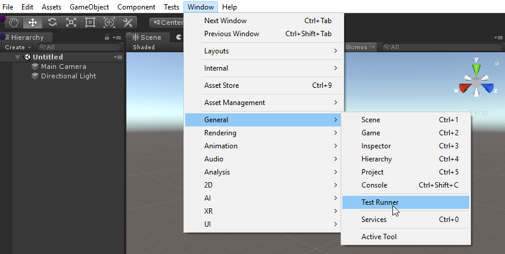

# Getting started with Unity Test Framework

To access the Unity Test Framework (UTF) in the Unity Editor, open the **Test Runner** window; go to **Window** > **General** > **Test Runner**.

To get started with UTF, follow the workflows below:

* [How to create a new test assembly](./workflow-create-test-assembly.md)
* [How to create a test](./workflow-create-test.md)
* [How to run a test](./workflow-run-test.md)
* [How to create a Play Mode test](./workflow-create-playmode-test.md)
* [How to run a Play Mode test as standalone](./workflow-run-playmode-test-standalone.md)

For further information, see the [resources](./resources.md) and [reference](./manual.md#reference) sections.

