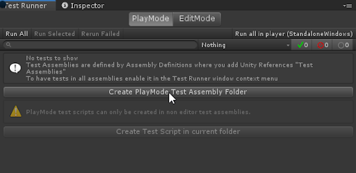
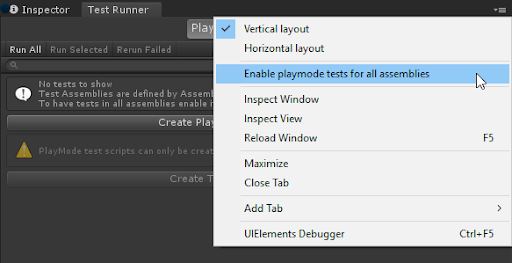

# Workflow: How to create a Play Mode test 

To create a **Play Mode** test, you can follow a similar process as when you want to create an **Edit Mode** test. 

1. Start with switching to the **PlayMode** tab in the **Test Runner** window.
2. Create a test assembly folder (see [How to create a new test assembly)](./workflow-create-test-assembly.md). The folder name is *Tests* by default (or *Tests 1*, *Tests 2*, etc. if the preceding name is already in use). 

> **Note**: If you don’t see the **Create Play Mode Test Assembly Folder** button enabled, make sure that in the Project window you navigate out of a folder with another .asmdef (such as one for Edit Mode tests). 

3. When you have your Play Mode test assembly folder ready, then [create your Play Mode test](./workflow-create-test.md). 

> **Note**: [Pre-defined Unity assemblies](https://docs.unity3d.com/Manual/ScriptCompileOrderFolders.html) (such as _Assembly-CSharp.dll_) do not reference your new assembly. 

## References and builds

Unity Test Framework adds a reference to `TestAssemblies` in the [Assembly Definition](https://docs.unity3d.com/Manual/ScriptCompilationAssemblyDefinitionFiles.html) file, but it won't include any other references (e.g., to other scripting assemblies within the Unity project). So you need to add other assemblies yourself if you want to test them too.

Unity does not include `TestAssemblies` in Player builds, but in the Test Runner window, we have such an option. If you need to test code in pre-defined assemblies, you can reference `TestAssemblies` from other assemblies. You must remove these tests after the test run so that Unity does not add them to the final Player build.

To do this, in the Test Runner window choose **Enable playmode tests for all assemblies** option from the drop-down menu (to expand, click on the small list item in the top right corner). In the dialog box, click **OK** to manually restart the Editor.

> **Note**: **Enabling Play Mode tests for all assemblies** includes additional assemblies in your project build, which can increase the project’s size as well as the build time.

For more information, see [Edit Mode vs. Play Mode tests](./edit-mode-vs-play-mode-tests.md).