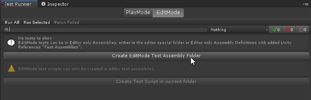
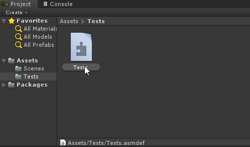
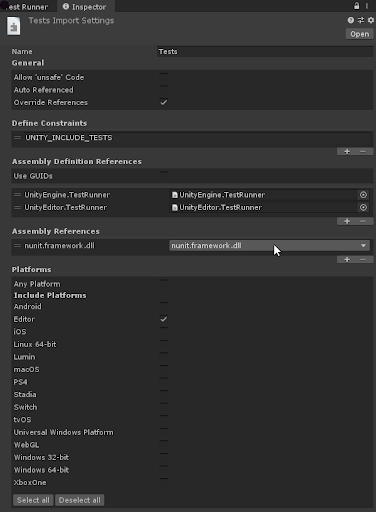

# Workflow: **How to create a new test assembly** 

Unity Test Framework looks for a test inside any assembly that references [NUnit](http://www.nunit.org/). We refer to such assemblies as `TestAssemblies`. The [Test Runner](./getting-started.md) UI can help you set up `TestAssemblies`. **Play Mode** and **Edit Mode** tests need to be in separate assemblies.

In the **Test Runner** window, you will see an **EditMode** tab enabled by default, as well as a **Create EditMode Test Assembly Folder** button. 

Click the button to create a *Tests* folder with a respective .asmdef file by default. Change the name of the new [Assembly Definition](https://docs.unity3d.com/Manual/ScriptCompilationAssemblyDefinitionFiles.html), if necessary, and press Enter to accept it.

In the Inspector window, it should have references to **nunit.framework.dll***,* **UnityEngine.TestRunner,** and **UnityEditor.TestRunner** assemblies, as well as **Editor** preselected as a target platform. 

> **Note**: The **UnityEditor.TestRunner** reference is only available for [Edit Mode tests](./edit-mode-vs-play-mode-tests.md#edit-mode-tests).

