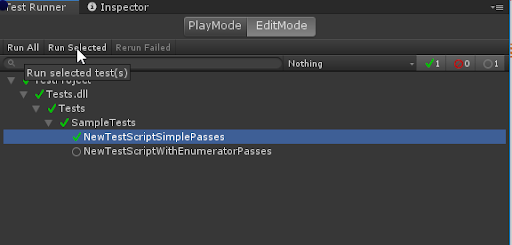

# Workflow: How to run a test

To run a test, you need to double-click on the test or test fixture name in the **Test Runner** window.

You can also use one of the buttons on the top bar, **Run All** or **Run Selected**. As a result, you’ll see the test status icon changed and a counter in the top right corner updated:

You may also use a context menu option **Run**, right-click on any item in the test tree to have it (with all its children if any) run. 

## Run tests within Rider

It is possible to run unit tests in the Unity Test Framework directly from [JetBrains Rider](https://www.jetbrains.com/rider/). 

For more information, see the [JetBrains official documentation](https://www.jetbrains.com/help/rider/Running_and_Debugging_Unity_Tests.html) and their blog post [Run Unity tests in Rider 2018.1](https://blog.jetbrains.com/dotnet/2018/04/18/run-unity-tests-rider-2018-1/).