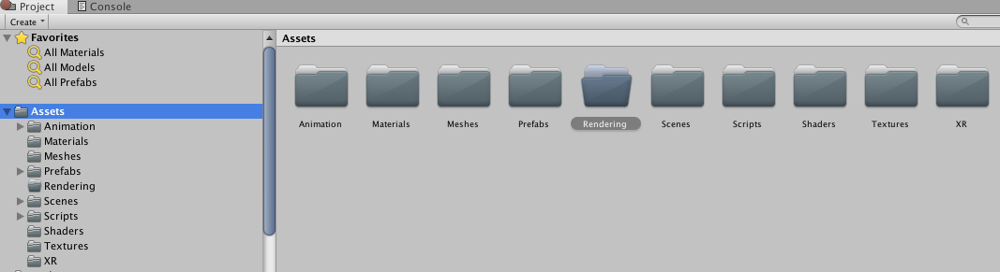
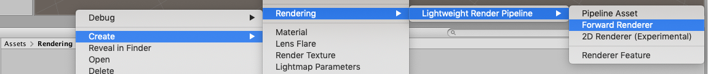
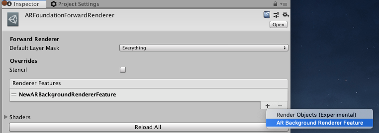
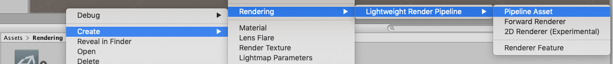
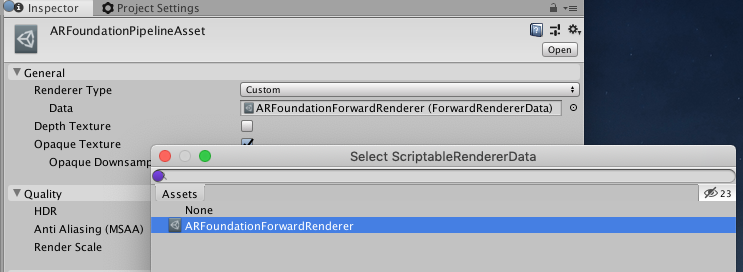
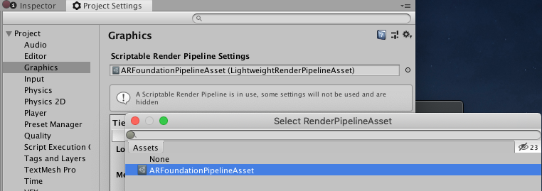

# Configuring AR Camera Background with a Scriptable Render Pipeline

AR Foundation supports the two scriptable render pipelines:
- Lightwight Render Pipeline (LWRP) - supported versions 5.7.2 or later
- Universal Render Pipeline (URP) - supported versions 7.0.0 or later

Note: Projects made using LWRP or URP are not compatible with the High Definition Render Pipeline or the built-in Unity rendering pipeline. Before you start development, you must decide which render pipeline to use in your Project.

## Basic Configuration for SRP with AR Foundation
1. In the project's Assets folder, create a new folder named "Rendering".

2. In the Assets > Rendering folder, create a `ForwardRenderer` for your SRP.
  - For LWRP, choose Create > Rendering > Lightweight Render Pipeline > Forward Renderer.
  - For URP, choose Create > Rendering > Universal Render Pipeline > Forward Renderer.

3. In the Inspector with the Forward Renderer selected, add a `ARBackgroundRendererFeature` to the list of Renderer Features.
  
4. In the Assets > Rendering folder, create a `PipelineAsset` for your SRP.
  - For LWRP, choose Create > Rendering > Lightweight Render Pipeline > Pipeline Asset.
  - For URP, choose Create > Rendering > Universal Render Pipeline > Pipeline Asset.

5. In the Inspector with the Pipeline Asset selected, add the Forward Renderer.
  1. Switch the Renderer Type to Custom.
  2. Select the Forward Renderer that you created for the Render Type > Data field.

6. In Project Settings > Graphics, select the Pipeline Asset for the Scriptable Render Pipeline Settings field.

