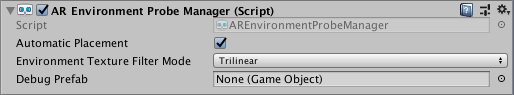

# AR Environment Probe Manager

The environment probe manager is a type of [trackable manager](trackable-managers.md).

Environment probes are a technique of capturing real-world imagery from a camera and organizing that information
into an environment texture, such as a cube map, that contains the view in all directions from a certain point in the
scene. Rendering 3D objects using this environment texture allows for real-world imagery to be reflected in the
rendered objects. The result is generally realistic reflections and lighting of virtual objects as influenced by the
real-world views.

For more details, refer to the [Environment Probe Subsystem](http://docs.unity3d.com/Packages/com.unity.xr.arsubsystems@latest?preview=1&subfolder=/manual/environment-probe-subsystem.html).

## Manual Placement

Environment probes can be created by calling `AREnvironmentProbeManager.AddEnvironmentProbe`. Like [reference points](reference-point-manager.md), the resulting `AREnvironmentProbe` may be in a "pending" state for a few frames.

You can remove an environment probe by calling `AREnvironmentProbeManager.RemoveEnvironmentProbe`. Note you should not `Destroy` an `AREnvironmentProbe` unless its manager has already been destroyed.

## Automatic Placement

Environment probes can be placed automatically, manually, or both. In automatic mode, the device automatically selects suitable locations for environment probes and creates them.

Note that environment probes can be created in any orientation. However, Unity's reflection probes, which consume the environment probe data, only support axis-aligned orientations. This means the orientation you specify (or which was selected automatically) may not be fully respected.

## Texture Filter Mode

This corresponds to the [UnityEngine.FilterMode](https://docs.unity3d.com/ScriptReference/FilterMode.html) for the cubemap generated by the envrionment probe.

## Debug Prefab

This prefab will be instantiated for each manually or automatically placed environment probe. This is not required, but provided for debugging purposes.
