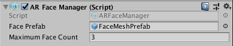

# AR Face Manager

The face manager is a type of [trackable manager](trackable-managers.md).

The face manager will create `GameObject`s for each detected face in the environment. The system only detects human faces.

In some implementations, face tracking requires a different camera (e.g., front-facing vs rear-facing) and may be incompatible with other features, such as plane or image tracking. Consider disabling other AR managers which manage trackables. These include
* [Plane Tracking](plane-manager.md)
* [Image Tracking](tracked-image-manager.md)
* [Object Tracking](tracked-object-manager.md)
* [Environment Probes](environment-probe-manager.md)

## Responding to Faces

Faces can be added, updated, and removed. Once per frame, the `facesChanged` event may be invoked with `List`s of faces that have been added, updated, and removed since the last frame.

When a face is detected, the AR Face Manager will instantiate the Face Prefab to represent the face. The Face Prefab may be left `null`, but the face manager ensures the instantiated `GameObject` has an `ARFace` component on it. The `ARFace` component just contains data about the detected face.

## Visualizing Faces

The face provider may provide a mesh representing the face. The `ARFace` component exposes `vertices`, `normals`, `indices`, and `uvs` (texture coordinates). Some or all of these may be available.

The `ARFaceMeshVisualizer` component will generate a `UnityEngine.Mesh` and update the `MeshFilter` on the same `GameObject` based on the data provided by the `ARFace`.

Check the face subsystem's `SubsystemDescriptor` (`ARFaceManager.descriptor`) for provider-specific features.
