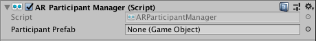

# AR Participant Manager

The participant manager is a type of [trackable manager](trackable-managers.md).

A "participant" is a user in a multi-user collaborative session. This feature currently has limited platform support (ARKit only at the time of writing).

Like all trackables, a participant can be identified by their `TrackableId`, which is unique to that participant. Participants can be added, updated, or removed, which corresponds to joining a collaborative session, updating the pose of the participant, and exiting a collaborative session, respectively.