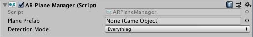
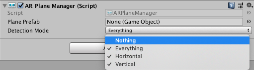
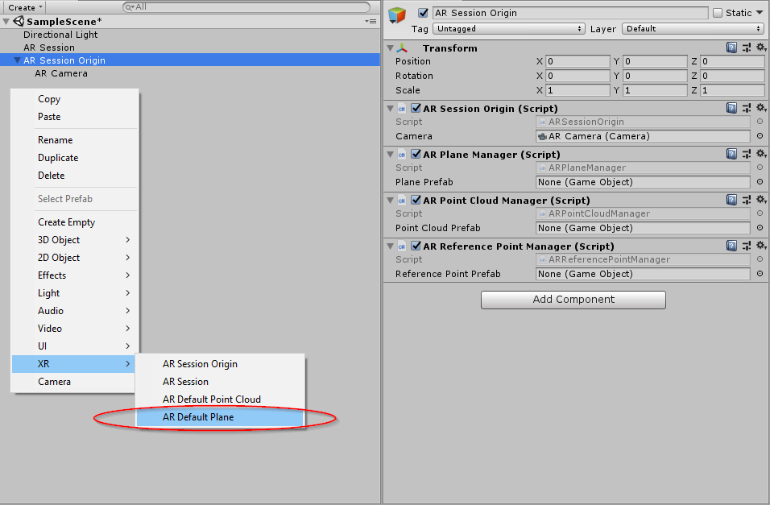
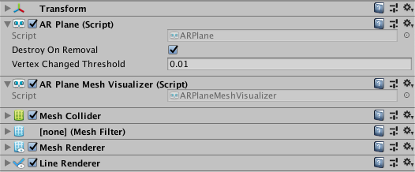
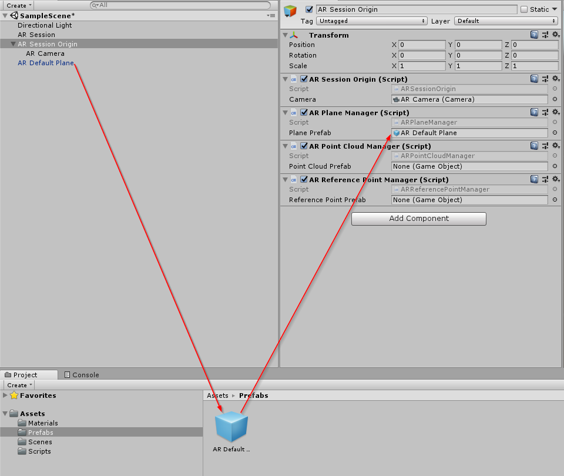

# AR Plane Manager

The plane manager is a type of [trackable manager](trackable-managers.md).



The plane manager will create `GameObject`s for each detected plane in the environment. A plane is a flat surface represented by a pose, dimensions, and boundary points. The boundary points are convex.

Examples of features in the environment that may be detected as planes are horizontal tables, floors, countertops, and vertical walls.

The AR Plane Manager component allows you to specify the detection mode, which can be horizontal, vertical, or both. Some platforms require extra work to perform vertical plane detection, so if you only need horizontal planes, you should disable vertical plane detection.



## Responding to Planes

Planes can be added, updated, and removed. Once per frame, the `planesChanged` event may be invoked with `List`s of planes that have been added, updated, and removed since the last frame.

When a plane is detected, the AR Plane Manager will instantiate the Plane Prefab to represent the plane. The Plane Prefab may be left `null`, but the plane manager ensures the instantiated `GameObject` has an `ARPlane` component on it. The `ARPlane` component just contains data about the detected plane.

When a plane is updated, it is likely that its boundary vertices have also changed. To respond to this event, subscribe to the plane's `ARPlane.boundaryChanged` event. This event will only fire if at least one boundary vertex has changed by at least the "Vertex Changed Threshold", or if the total number of vertices changes.

## Visualizing Planes

To visualize planes, you'll need to create a prefab or `GameObject` which includes a component that subscribes to `ARPlane`'s `boundaryChanged` event. `ARFoundation` provides an `ARPlaneMeshVisualizer`. This component will generate a `Mesh` from the boundary vertices and assign it to a `MeshCollider`, `MeshFilter`, and `LineRenderer`, if present.

There is a menu item `GameObject > XR > AR Default Plane` which will create a new `GameObject` which you can use to create your prefab.



Once created, you should assign it to the `ARPlaneManager`'s `Plane Prefab` field. You can use it directly or create a prefab by dragging the `GameObject` into your Assets folder. The default plane looks like this:



It is recommended to save the `AR Default Plane` as a prefab first, delete the `AR Default Plane` GameObject, and then use that in the prefab field as leaving the plane in your scene will leave a zero scale plane artifact in the scene.



These components are included for ease of use, but you may wish to create your own visualizers (or other logic) as you see fit.

## Disabling Planes

As long as the AR Plane Manager is enabled, it will continue to create, update, and remove planes. If you want to stop rendering existing planes, you can simply deactivate their `GameObject`s:

```csharp
foreach (var plane in planeManager.trackables)
{
    plane.gameObject.SetActive(false);
}
```

You should not directly `Destroy` an `ARPlane` while it is being managed by the plane manager.
