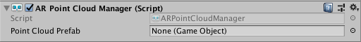

# AR Point Cloud Manager

The point cloud manager is a type of [trackable manager](trackable-managers.md).

The point cloud manager creates point clouds, sets of feature points. A feature point is a specific point in the point cloud which the device uses to determine its location in the world. Feature points are typically notable features in the environment that the device can track between frames, such as a knot in a wooden table.

A point cloud is a set of feature points which can change from frame to frame. Some platforms only produce one point cloud, while others organize their feature points into different point clouds in different areas of space.

A point cloud is considered a trackable, while individual feature points are not. However, feature points can be uniquely identified between frames as they have unique identifiers.

## Feature Point Properties

Each feature point has a position, and optionally an identifier and confidence value. These are stored as parallel arrays of `Vector3`, `ulong`, and `float`, respectively.

### Position

Each feature point has a 3D position, reported in session space. Access them via [`ARPointCloud.positions`](../api/UnityEngine.XR.ARFoundation.ARPointCloud.html##UnityEngine_XR_ARFoundation_ARPointCloudManager_positions).

### Identifier

Each feature point may have a unique identifier, represented as a `ulong`. Access them via [`ARPointCloud.identifiers`](../api/UnityEngine.XR.ARFoundation.ARPointCloud.html##UnityEngine_XR_ARFoundation_ARPointCloudManager_identifiers).

This array is parallel to `positions`. This feature varies by provider. Check the `SubsystemDescriptor` (`ARPointCloud.descriptor`).

### Confidence Value

Feature points may also have confidence values, represented as `float`s from 0..1. Access them via [`ARPointCloud.confidenceValues`](../api/UnityEngine.XR.ARFoundation.ARPointCloud.html##UnityEngine_XR_ARFoundation_ARPointCloudManager_confidenceValues).

This array is parallel to `positions`. This feature varies by provider. Check the `SubsystemDescriptor` (`ARPointCloud.descriptor`).
