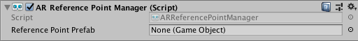

# AR Reference Point Manager

The reference point manager is a type of [trackable manager](trackable-managers.md).



The reference point manager will create `GameObject`s for each reference point. A reference point is a particular point in space that you are asking the device to track. Some SDKs refer to these as "anchors". The device typically performs additional work to update the position and orientation of the reference point throughout its lifetime. Reference points are generally resource intensive objects that should be used sparingly.

## Adding and Removing Reference Points

Reference points are typically added and removed via script, by calling `AddReferencePoint` and `RemoveReferencePoint` on the `ARReferencePointManager`. In some cases reference points may be created through other means, such as loading an AR World Map on ARKit which includes saved reference points.

When you add a reference point, it may take a frame or two before it is reported as added by the reference point manager's `referencePointsChanged` event. Between the time you add it and it is reported as added, the reference point will be in a "pending" state. You can query for this with the `ARReferencePoint.pending` property.

Likewise, when you remove a reference point, it may be a frame before it is reported as having been removed. If you remove a reference point before it is reported as added, you will not receive any events for it.

You should always remove reference points through the reference point manager. Do not `Destroy` an `ARReferencePoint` unless its manager has also been destroyed.

## Attaching Reference Points

You can also create reference points that are "attached" to a plane. The following `ARReferencePointManager` method does this
```csharp
public ARReferencePoint AttachReferencePoint(ARPlane plane, Pose pose)
```

"Attaching" to a plane affects the semantics for a reference point update. Reference points will only change their position along the normal of the plane they are attached to, effectively maintaining a constant distance from the plane.
