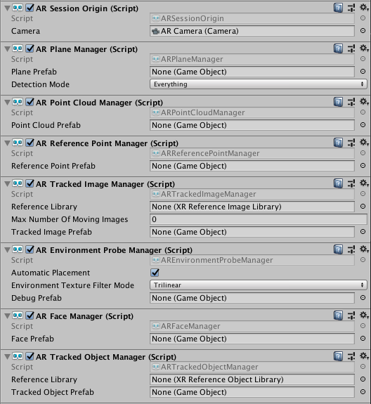
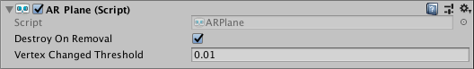

# Trackable Managers

In AR Foundation, a "trackable" is anything that can be detected and tracked in the real world. Planes, point clouds, reference points, environment probes, faces, images, and 3d objects are all examples of trackables.

Each trackable has a trackable manager. All the trackable managers must be on the same `GameObject` as the AR Session Origin. This is because the session origin defines the transform to which all the detected trackables are relative. The trackable managers use the session origin to place the detected trackables in the correct place in the Unity scene graph.

This image shows the session origin with all the trackable managers:



This table summarizes the trackable managers and their trackables.
| Trackable Manager                                           | Trackable            | Purpose |
|-------------------------------------------------------------|----------------------|---------|
| [`ARPlaneManager`](plane-manager.md)                        | `ARPlane`            | Detects flat surfaces. |
| [`ARPointCloudManager`](point-cloud-manager.md)             | `ARPointCloud`       | Detects feature points. |
| [`ARReferencePointManager`](reference-point-manager.md)     | `ARReferencePoint`   | Manages reference points. You can manually add and remove them with `ARReferencePointManager.AddReferencePoint` and `ARReferencePointManager.RemoveReferencePoint`. |
| [`ARTrackedImageManager`](tracked-image-manager.md)         | `ARTrackedImage`     | Detects and tracks 2D images. |
| [`AREnvironmentProbeManager`](environment-probe-manager.md) | `AREnvironmentProbe` | Creates cubemaps representing the environment. |
| [`ARFaceManager`](face-manager.md)                          | `ARFace`             | Detects and tracks human faces. |
| [`ARTrackedObjectManager`](tracked-object-manager.md)       | `ARTrackedObject`    | Detects 3D objects. |
| [`ARParticipantManager`](participant-manager.md)            | `ARParticipant`      | Tracks other users in a multi-user collaborative session |

Each trackable component stores information about the trackable, but does not visualize it. Its `transform` is updated by its manager whenever the AR device reports an update.

## Enabling and Disabling Features

Enabling a trackable manager will enable or "turn on" that feature. For example, you can toggle plane detection by enabling or disabling the AR Plane Manager. Enabling a particular feature may cause the device to consume more power, so it is best to disable managers when you are not using them.

## Enumerating Trackables

Trackables can be enumerated via their manager with the `trackables` member, e.g.,

```csharp
var planeManager = GetComponent<ARPlaneManager>();
foreach (ARPlane plane in planeManager.trackables)
{
    // Do something with the ARPlane
}
```

The `trackables` property returns a `TrackableCollection`, which can be enumerated in a `foreach` statement as in the above example. You can also query for a particular trackable with the `TryGetTrackable` method.

## Trackable Lifetime

Each trackable can be added, updated, and removed. Each frame, the managers query for the set of changes to their trackables since the previous frame. Each manager has an event to which you can subscribe to be notified of these changes:

| Trackable Manager | Event |
|-|-|
|`ARPlaneManager`               | `planesChanged`|
|`ARPointCloudManager`          |`pointCloudsChanged`|
|`ARReferencePointManager`      |`referencePointsChanged`|
| `ARTrackedImageManager`       | `trackedImagesChanged`    |
| `AREnvironmentProbeManager`   | `environmentProbesChanged` |
| `ARFaceManager`               | `facesChanged` |
| `ARTrackedObjectManager`      | `trackedObjectsChanged` |
| `ARParticipantManager`        | `participantsChanged` |

A trackable will always be added before it is updated or removed. Likewise, a trackable can not be removed unless it was first added. Updates depend on the semantics of the trackable, and the provider-specific implementation.

### Adding and Removing Trackables

Some trackables, like reference points and environment probes, can be added and removed manually. Other trackables, like planes, are automatically detected and removed. Some trackables can be both manually added and automatically created. The relevant managers provide methods for addtion and removal when supported.

You should never `Destroy` a trackable component or its `GameObject` directly. For trackables that support manual removal, its manager will provide a method to remove it. For example, to remove a reference point, you would call `RemoveReferencePoint` on the `ARReferencePointManager`.

When you manually add a trackable, it may not be tracked by the underlying subsystem immediately. You will not get an added event for that trackable until the subsystem reports that it has been added (typically on the next frame). During the time between manual addition and the added event, the trackable will be in a "pending" state. You can check this with the `pending` property on every trackable.

For example, if you add a reference point, it will likely be pending until the next frame:
```csharp
var referencePoint = referencePointManager.AddReferencePoint(new Pose(position, rotation));
Debug.Log(referencePoint.pending); // "true"

// -- next frame --
void OnReferencePointsChanged(ARReferencePointsChangedEventArgs eventArgs)
{
    foreach (var referencePoint in eventArgs.added)
    {
        // reference point added above now appears in this list.
    }
}
```

The exact amount of time a trackable spends in the `pending` state depends on the underlying implementation.

When a trackable receives a removal notification, its manager will `Destroy` the trackable's `GameObject` unless `destroyOnRemoval` is false.



#### Deactivating Existing Trackables

Sometimes, you may want to stop performing behavior associated with a trackable without disabling its manager. For example, you may wish to stop rendering detected planes even though you do not wish to stop plane detection.

Simply deactivate each trackable's `GameObject`:

```csharp
var planeManager = GetComponent<ARPlaneManager>();
foreach (var plane in planeManager.trackables)
{
    plane.gameObject.SetActive(false);
}
```

## Controlling the `GameObject` for a Trackable

When a new trackable is detected, its manager will instantiate a prefab configurable on the manager. The instantiated `GameObject` must have an `ARTrackable` component for that type of trackable. If the prefab is `null`, a `GameObject` with only the relevant `ARTrackable` will be created. If your prefab does not have the relevant `ARTrackable`, one will be added.

For example, when the plane manager detects a plane, it will create a `GameObject` using the "Plane Prefab" if specified, or an empty `GameObject` otherwise. Then it will ensure it has an `ARPlane` component on it.
