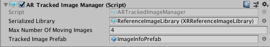

# AR Tracked Image Manager

The tracked image manager is a type of [trackable manager](trackable-managers.md).



The tracked image manager will create `GameObject`s for each detected image in the environment. Before an image can be detected, the manager must be instructed to look for a set of reference images compiled into a reference image library. Only images in this library will be detected.

## Reference Library

Refer to the documentation for the [Tracked Image Subsystem](http://docs.unity3d.com/Packages/com.unity.xr.arsubsystems@latest?preview=1&subfolder=/manual/image-tracking.html) for instructions for creating a reference image library in the Editor.

The reference image library can be set at runtime, but as long as the tracked image manager component is enabled, the reference image library must be non-null. You can set it via script with

```csharp
ARTrackedImageManager manager = ...;
manager.referenceLibrary = myReferenceImageLibrary;
```

You may set the reference image library to be either an `XRReferenceImageLibrary` or a `RuntimeReferenceImageLibrary`. An `XRReferenceImageLibrary` can only be created in the Editor and may not be modified at runtime. (The actual image library data is provider-specific; refer to your provider's documentation for details.) A `RuntimeReferenceImageLibrary` is the runtime representation of an `XRReferenceImageLibrary`. When you set the library to be an `XRReferenceImageLibrary`, it is automatically converted to a `RuntimeReferenceImageLibrary` for consumption by the image tracking subsystem.

You can create a `RuntimeReferenceImageLibrary` from an `XRReferenceImageLibrary` with the [`ARTrackedImageManager.CreateRuntimeLibrary`](../api/UnityEngine.XR.ARFoundation.ARTrackedImageManager.html#UnityEngine_XR_ARFoundation_ARTrackedImageManager_CreateRuntimeLibrary_XRReferenceImageLibrary_) method:
```csharp
XRReferenceImageLibrary serializedLibrary = ...
RuntimeReferenceImageLibrary runtimeLibrary = trackedImageManager.CreateRuntimeLibrary(serializedLibrary);
```

## Adding new reference images at runtime

Some subsystems may support image libraries that are modifiable at runtime. If this is the case, the `RuntimeReferenceImageLibrary` produced by the subsystem will be a `MutableRuntimeReferenceImageLibrary`. To use it, you will need to cast the `RuntimeReferenceImageLibrary` to a `MutableRuntimeReferenceImageLibrary`:
```csharp
if (trackedImageManager.referenceLibrary is MutableRuntimeReferenceImageLibrary mutableLibrary)
{
    // use the mutableLibrary
}
```

To create an empty library (e.g., to add images to it later), you can call `CreateRuntimeLibrary` without arguments:
```csharp
var library = trackedImageManager.CreateRuntimeLibrary();
if (library is MutableRuntimeReferenceImageLibrary mutableLibrary)
{
    // add images to mutableLibrary
}
```

You can check whether a particular tracked image manager supports mutable libraries with its descriptor:
```csharp
if (trackedImageManager.descriptor.supportsMutableLibrary)
{
    // Mutable reference image libraries are supported
}
```

Mutable libraries allow images to be added to them at any time. Adding an image can be computationally expensive, and may take a few frames to complete. The [Unity Job System](https://docs.unity3d.com/Manual/JobSystem.html) is used to process images asynchronously.

To add an image to a `MutableRuntimeReferenceImageLibrary`, use the method [`ScheduleAddImageJob`](../api/UnityEngine.XR.ARFoundation.MutableRuntimeReferenceImageLibraryExtensions.html#UnityEngine_XR_ARFoundation_MutableRuntimeReferenceImageLibraryExtensions_ScheduleAddImageJob_MutableRuntimeReferenceImageLibrary_Texture2D_System_String_System_Nullable_System_Single__JobHandle_). This returns a `JobHandle` that you can use to determine when the job is complete. It is safe to discard this handle if you do not need to do this.

Multiple add image jobs can be processed concurrently, and it is okay if the `MutableRuntimeReferenceImageLibrary` is currently being used for image tracking.

## Creating a manager at runtime

When you add a component to an active `GameObject` at runtime, Unity immediately invokes its `OnEnable` method. However, the `ARTrackedImageManager` requires a non-null reference image library. Therefore, if the reference image library is null when the `ARTrackedImageManager` is enabled, it will automatically disable itself.

To add an `ARTrackedImageManager` at runtime, set its reference image library and then re-enable it:

```csharp
var manager = gameObject.AddComponent<ARTrackedImageManager>();
manager.referenceLibrary = myLibrary;
manager.enabled = true;
```

## Max Number of Moving Images

Some providers can track moving images. This typically requires more CPU resources, so you can specify the number of moving images to track simultaneously. Check for support via the `SubsystemDescriptor` (`ARTrackedImageManager.descriptor`).

## Tracked Image Prefab

This prefab will be instantiated whenever an image from the reference image library is detected. The manager ensures the instantiated `GameObject` includes an `ARTrackedImage` component. You can get the reference image that was used to detect the `ARTrackedImage` with the `ARTrackedImage.referenceImage` property.
