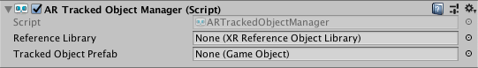

# AR Tracked Object Manager

The tracked object manager is a type of [trackable manager](trackable-managers.md).



The tracked object manager will create `GameObject`s for each detected object in the environment. Before an object can be detected, the manager must be instructed to look for a set of reference objects compiled into a reference object library. Only objects in this library will be detected.

## Reference Library

Refer to the documentation for the [Tracked Object Subsystem](http://docs.unity3d.com/Packages/com.unity.xr.arsubsystems@latest?preview=1&subfolder=/manual/object-tracking.html) for instructions for creating a reference object library.

The reference object library can be set at runtime, but as long as the tracked object manager component is enabled, the reference object library must be non-null.

The reference object library is an instance of the `ScriptableObject` `XRReferenceImageLibrary`. This object contains mostly Editor data. The actual library data (containing the object data) is provider-specific. Refer to your provider's documentation for details.

## Creating a manager at runtime

When you add a component to an active `GameObject` at runtime, Unity immediately invokes its `OnEnable` method. However, the `ARTrackedObjectManager` requires a non-null reference object library. Therefore, if the reference object library is null when the `ARTrackedObjectManager` is enabled, it will automatically disable itself.

To add an `ARTrackedObjectManager` at runtime, set its reference object library and then re-enable it:

```csharp
var manager = gameObject.AddComponent<ARTrackedObjectManager>();
manager.referenceLibrary = myLibrary;
manager.enabled = true;
```

## Tracked Object Prefab

This prefab will be instantiated whenever an object from the reference object library is detected. The manager ensures the instantiated `GameObject` includes an `ARTrackedObject` component. You can get the reference object that was used to detect the `ARTrackedObject` with the `ARTrackedObject.referenceObject` property.
