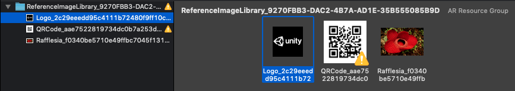

# Image Tracking

To use image tracking on ARKit, you will first need to create a Reference Image Library. See the [AR Subsystems documentation on image tracking](https://docs.unity3d.com/Packages/com.unity.xr.arsubsystems@2.1/image-tracking.html) for instructions.

During an iOS player build, each reference image library is used to generate a corresponding AR Resource Group in the generated Xcode project:

The resource group and the images within it are named according to the name the user specifies in the Unity Editor concatenated with a guid so the image can be uniquely identified at runtime.

ARKit's AR Reference Images can be either JPEG or PNG files. If a different type of source texture is specified in the `XRReferenceImageLibrary`, then we attempt to convert the texture to a PNG for ARKit to use. Exporting a `Texture2D` to PNG can fail for several reasons. For instance, the texture must be marked both readable and uncompressed in the texture importer settings. Note that if you plan to use the texture at runtime (and not just as a source asset for the reference image), you should create a separate PNG or JPEG as the source asset, since those texture import settings can have undesirable performance or memory impacts at runtime.

## Reference Image Dimensions

Image dimensions are required on ARKit. When you specify the dimensions for a reference image, only the image's width is provided to ARKit. Xcode computes the height from the image's aspect ratio.
