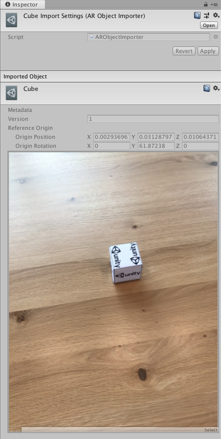
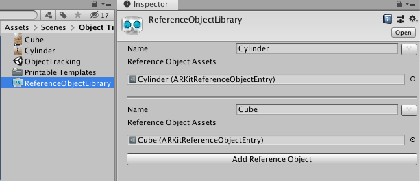

# Object Tracking

To use object tracking on ARKit, you will first need to create a Reference Object Library. See the [AR Subsystems documentation on object tracking](https://docs.unity3d.com/Packages/com.unity.xr.arsubsystems@2.1/object-tracking.html) for instructions.

Next, you will need to create an ARKit-specific version of the reference object. See [Scanning and Detecting 3D Objects](https://developer.apple.com/documentation/arkit/scanning_and_detecting_3d_objects) for an app that you can run on an iOS device that will produce such a scan.

The scanning app produces a file with the extension `.arobject`. Drag each `.arobject` file into your Unity project, and Unity will generate an `ARKitReferenceObjectEntry` for it.

You should see some metadata and a preview image of the scan.

The arobject can now be added to a reference object in your reference object library:

