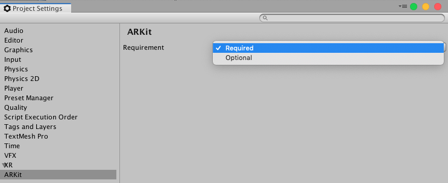
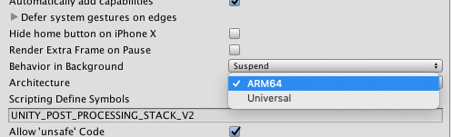

# About ARKit XR Plugin

Use the *ARKit XR Plugin* package enable ARKit support via Unity's multi-platform XR API. This package implements the following XR Subsystems:

* [Session](https://docs.unity3d.com/Packages/com.unity.xr.arsubsystems@3.0/manual/session-subsystem.html)
* [Camera](https://docs.unity3d.com/Packages/com.unity.xr.arsubsystems@3.0/manual/camera-subsystem.html)
* [Depth](https://docs.unity3d.com/Packages/com.unity.xr.arsubsystems@3.0/manual/depth-subsystem.html)
* [Input](https://docs.unity3d.com/2018.1/Documentation/ScriptReference/Experimental.XR.XRInputSubsystem.html)
* [Planes](https://docs.unity3d.com/Packages/com.unity.xr.arsubsystems@3.0/manual/plane-subsystem.html)
* [Raycast](https://docs.unity3d.com/Packages/com.unity.xr.arsubsystems@3.0/manual/raycast-subsystem.html)
* [ReferencePoints](https://docs.unity3d.com/Packages/com.unity.xr.arsubsystems@3.0/manual/reference-point-subsystem.html)
* [Image Tracking](https://docs.unity3d.com/Packages/com.unity.xr.arsubsystems@3.0/manual/image-tracking.html)
* [Object Tracking](https://docs.unity3d.com/Packages/com.unity.xr.arsubsystems@3.0/manual/object-tracking.html)
* [Environment Probes](https://docs.unity3d.com/Packages/com.unity.xr.arsubsystems@3.0/manual/environment-probe-subsystem.html)
* [Participants](https://docs.unity3d.com/Packages/com.unity.xr.arsubsystems@3.0/manual/participant-subsystem.html)

This version of *ARKit XR Plugin* supports the following features:

* Device Localization
* Horizontal Plane Detection
* Vertical Plane Detection
* Point Clouds
* Pass-through Camera View
* Light Estimation
* Reference Points
* Hit Testing
* Session Management
* Image Tracking
* Object Tracking
* Environment Probes
* Participants

[Face Tracking](https://docs.unity3d.com/Packages/com.unity.xr.arsubsystems@2.1/manual/face-tracking.html) support is available in the separate "ARKit Face Tracking" package. Apple's App Store will reject an app that contains certain face tracking-related symbols in its binary if the app developer does not intend to use face tracking, so we've broken out face tracking support into a separate package to avoid any ambiguity.

# Installing ARKit XR Plugin

To install this package, follow the instructions in the [Package Manager documentation](https://docs.unity3d.com/Packages/com.unity.package-manager-ui@latest/index.html).

In addition, you will likely want to also install the *ARFoundation* package which makes use of *ARKit XR Plugin* package and provides many useful scripts and prefabs.

# Using ARKit XR Plugin

The *ARKit XR Plugin* implements the native iOS endpoints required for building Handheld AR apps using Unity's multi-platform XR API. However, this package does not expose any public scripting interface of its own and most developers should use the scripts, prefabs, and assets provided by *ARFoundation* as the basis for their Handheld AR apps.

Inclusion of the *ARKit XR Plugin* will result in the inclusion of source files, static libraries, shader files, and plugin metadata to be included in the XCode project generated as part of the Unity's standard iOS build process.

ARKit requires iOS 11.0. Some specific features require later versions (see below).

## Build Settings

From the menu, choose _Edit > Project Settings_ then navigate to _XR > ARKit_:

### AR Requirement

ARKit can be either "required" or "optional". By default it is "required", which means the app will only be installable on AR-supported devices and operating systems (ARKit requires iOS 11.0). You can specify that AR is "optional", in which case your app will be installable on all iOS devices.

## Session

See the [ARSubsystems Session](https://docs.unity3d.com/Packages/com.unity.xr.arsubsystems@2.1/manual/session-subsystem.html) documentation for more details. ARKit's implementation of `XRSessionSubsystem.GetAvailabilityAsync` is trivial, as the device simply needs to check that it is at least on running iOS 11.0.

## Depth Subsystem

See the [ARSubsystems Depth Subsystem](https://docs.unity3d.com/Packages/com.unity.xr.arsubsystems@2.1/manual/depth-subsystem.html) documentation for more details. Raycasts always return a `Pose` for the item the raycast hit. When raycasting against feature points, the pose always has an identity rotation.

The depth subsystem does not require additional resources, so enabling it does not incur any performance impact.

ARCore's depth subsystem will only ever produce a single [`XRPointCloud`](https://docs.unity3d.com/Packages/com.unity.xr.arsubsystems@2.1/api/UnityEngine.XR.ARSubsystems.XRPointCloud.html).

## Plane Tracking

See the [ARSubsystems Plane Subsystem](https://docs.unity3d.com/Packages/com.unity.xr.arsubsystems@2.1/manual/plane-subsystem.html) documentation for more details. ARKit does not support plane subsumption; there is no merge event. If two planes are determined to be separate parts of the same surface, one plane may be removed while the other expands to the explored surface.

ARKit provides boundary points for all its planes on iOS 11.3 and later. Boundary points are not available in iOS 11.0.

The ARKit plane subsystem requires additional CPU resources and can be energy intensive. Enabling both horizontal and vertical plane detection (available in iOS 11.3+) requires additional resources. Consider disabling plane detection when not needed to save energy.

Setting the plane detection mode to `PlaneDetectionMode.None` is equivalent to `Stop`ping subsystem.

## Image Tracking

See [Image Tracking](arkit-image-tracking.md).

## Object Tracking

See [Object Tracking](arkit-object-tracking.md).

## Participant Tracking

A "participant" represents another device in a multi-user collaborative session. Although you can start and stop the participant subsystem at any time, the session must be fed `ARCollaborationData` from other peers in the multi-user session in order for participants to be detected. See the [ARCollaborationData sample](https://github.com/Unity-Technologies/arfoundation-samples/tree/master/Assets/Scenes/ARCollaborationData).

# Technical details
## Requirements

This version of *ARKit XR Plugin* is compatible with the following versions of the Unity Editor:

* 2018.3 and later (recommended)

## Known limitations

* Color Correction is not available as an RGB Value (only as color temperature).
* Only 64-bit devices are supported by this package. In the iOS player settings, you need to select ARM64 as the target architecture (the default is Universal).

## Package contents

This version of *ARKit XR Plugin* includes:

* A static library which provides implementation of the XR Subsystems listed above
* An Objective-C source file
* A shader used for rendering the camera image
* A plugin metadata file

## Document revision history
|Date|Reason|
|---|---|
|April 22, 2019|Update documentation to include new subsystems and the migration of face tracking to a separate package.|
|April 19, 2018|Documentation update. Added support for vertical planes and boundary points for all planes.|
|December 18, 2018|Add environment probe support. Updated the requirements to be Unity 2018.3.|
|November 14, 2018|Add Face Tracking support.|
|October 9, 2018|Remove lack of ARWorldMap support as a known limitation; it is now supported.|
