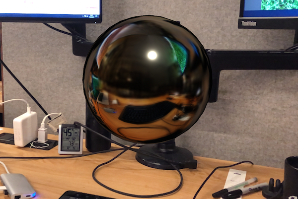

# About XR Environment Probe Subsystem

The purpose of this subsystem is to provide an interface for managing and interacting with XR environment
probes.

Environment probes are an XR technique of capturing real-world imagery from a camera and organizing that information
into an environment texture, such as a cube map, that contains the view in all directions from a certain point in the
scene. Rendering 3D objects using this environment texture allows for real-world imagery to be reflected in the
rendered objects. The result is generally realistic reflections and lighting of virtual objects as influenced by the
real-world views.

In an XR application, environment probe functionality provides valuable lighting and reflection data from the
real-world views that are used by the renderer to enhance the appearance of the rendered objects allowing for the
virtual scene to blend better with the real-world environment. The following image illustrates the use of the
environment texture from an environment probe applied to a sphere as a reflection map.

## Environment probes

An environment probe is a location in space at which environment texturing information is captured. Each environment
probe has a scale, orientation, position, and bounding volume size.  The scale, orientation, and position properties
define the transformation of the environment probe relative to the AR session origin. The bounding size defines the
volume around the environment probes position. An infinite bounding size indicates that the environment texture may be
used for global lighting whereas a finite bounding size expresses that the environment texture captures the local
lighting conditions in a specific area surrounding the environment probe.

Environment probes may be placed at locations in the real-world to capture the environment information at each probe
location. The placement of environment probes occurs via two different mechanisms:
- Manual placement

  Environment probes are manually placed in the scene. To achieve the most accurate environment information for a
  specific virtual object, increasing the proximity of an environment probe to the location of the virutal object
  improves the quality of the rendered object. Thus, manually placing an environment probe in or near important virtual
  objects results in the most accurate environment information to be produced for that object.

  Furthermore, if a virtual object is moving and the path of that movement is known, placing multiple environment
  probes along the movement path allows the rendering of that object to better reflect the motion of the virtual object
  through the real-world environment.

- Automatic placement

  Providing implementations may implement their own algorithms for choosing how and where to best place environment
  probes to achieve a good quality of environment information. Typically, the determination for automatic environment
  probe placement relies on key feature points that have been detected in the real-world environment. The methodology
  for making these automatic placement choices is completely in the control of the providing implementation.

Automatically placed environment probes provide a good overall set of environment information for the detected
real-world features. However, manually placing environment probes at the locations of key virtual scene objects allow
for improved environmental rendering quality of those important virtual objects.

# Using XR Environment Probe Subsystem

This package defines only the abstract interface for interacting with environment probe functionality. To use this
functionality in an application, you need to install a package that provides an implementation for the environment
probe functionality.

This package adds new C# APIs for interacting with XR environment probe functionality. Refer to the
[Scripting API](../api/index.html) documentation for working with the environment probe interface.
