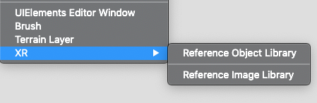

# XR Image Tracking Subsystem

The image tracking subsystem attempts to detect two dimensional images in the environment that have previously been stored in a library of reference images.

## Terminology
**Reference Image**

A reference image is an image that the `XRImageTrackingSubsystem` will attempt to find in the real world. Detected images will be associated with the reference image used to detect them. Each detected image has a pose in the world.

**Reference Image Library**

A set of reference images. When you start an image tracking subsystem, you will first need to provide it with a library of reference images so that it knows what to search for.

**Provider**

The image tracking subsystem is an interface which is implemented in other packages. Each implementation is called a "provider". You might have a different provider package for each AR platform, for example.

## Creating a Reference Image Library

In the Unity Editor, create a Reference Image Library, then fill it with reference images. In the Editor, click *Assets > Create > XR > Reference Image Library*:



This creates a new reference image library asset in your project. Select it, and start adding reference images by clicking "Add Image" and populating the resulting fields:


Reference images have a name, optional size, and can optionally keep the texture at runtime.

|Field|Meaning|
|------|-------|
|Name|A string name which will be available at runtime. This name is not used by the subsystem, but it can be useful for identifying which reference image has been detected. There is no check for name collisions.|
|Specify Size|If enabled, you can specify the physical size you expect the image to have in the real world. Some providers require this field to be set, while it is optional on others. Refer to your provider's documentation for more details. If specified, the dimensions must be greater than zero. Editing one dimensions (e.g., width) will cause the other dimension (e.g., height) to change automatically based on the image's aspect ratio.|
|Keep Texture at Runtime|If enabled, `XRReferenceImage.texture` will contain a reference to the source texture. This can be useful if you need access to the source texture at runtime. This is unchecked by default to reduce the built Player size. When unchecked, `XRReferenceImage.texture` will be null.|

## Using the Library at Runtime

To use the library at runtime, set it on the subsystem, e.g.:

```csharp
XRReferenceImageLibrary myLibrary = ...
XRImageTrackingSubsystem subsystem = ...

subsystem.imageLibrary = myLibrary;
subsystem.Start();
```
Note that you _must_ set `imageLibrary` to a non-`null` reference before starting the subsystem.

Query for changes to tracked objects with `XRImageTrackingSubsystem.GetChanges`. This will return all changes to tracked images (added, updated, and removed) since the last call to this method.
