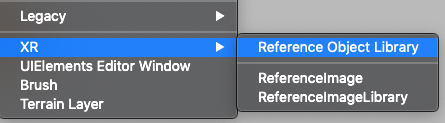
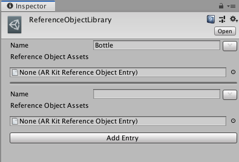

# XR Object Tracking Subsystem

The object tracking subsystem attempts to detect three dimensional objects in the environment that have previously been scanned and stored in a library of reference objects.

## Terminology
**Reference Object**

A reference object is a previously scanned object. The object tracking subsystem will attempt to find instances of the object and report on their poses.

**Reference Object Library**

A set of reference objects. When you start an object tracking subsystem, you will first need to provide it with a library of reference objects so that it knows what to search for.

**Provider**

A "provider" in this context is a specific implementation of the object tracking subsystem. Subsystems are interfaces that are implemented in other packages. You might have a different provider package for each AR platform, for example.

## Creating a Reference Object Library

In the Unity Editor, you need to create a Reference Object Library, then fill it with reference objects. Each reference object requires a provider-specific representation for each provider package you have in your project.

In the Editor, click *Assets > Create > XR > Reference Object Library*:



This creates a new asset in your project. Select it, and start creating reference objects:



Reference Objects have a name followed by a list of provider-specific entries. In this example, I only have one entry for ARKit.

You will need to then populate the reference object entries with provider-specific assets. Refer to the provider's documentation for instructions on how to do this.

## Using the Library at Runtime

To use the library at runtime, set it on the subsystem, e.g.:

```csharp
XRReferenceObjectLibrary myLibrary = ...
XRObjectTrackingSubsystem subsystem = ...

subsystem.library = myLibrary;
subsystem.Start();
```

Note that you _must_ set `library` to a non-`null` reference before starting the subsystem.

Query for changes to tracked objects with `XRObjectTrackingSubsystem.GetChanges`. This will return all changes to tracked objects (added, updated, and removed) since the last call to this method.
